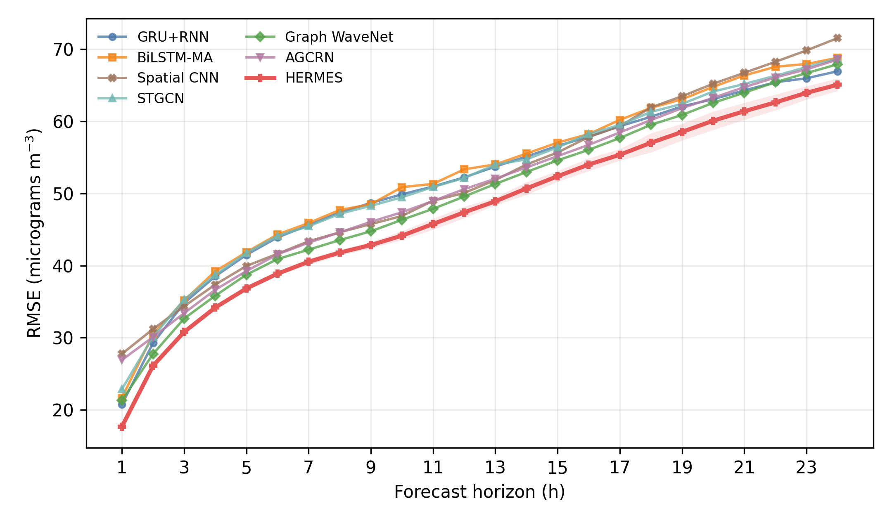

# HERMES Beijing PM2.5 Reproducibility Package

This folder contains the public release package for the HERMES model used in the manuscript
`HERMES: A Meteorology-Guided Horizon-Specialized Ensemble for Multi-Horizon Urban PM2.5 Forecasting`.

**HERMES** means **Horizon-specialized Ensemble Residual Meteorology-Enhanced System**. HERMES
forecasts H1-H24 PM2.5 at 12 Beijing stations from the previous 24 h of pollution, local
meteorology, and historical ERA5 reanalysis.

The package is scoped to the manuscript's clean-split comparison. It includes:

- Beijing Multi-Site Air-Quality raw CSV files and the processed 3 x 4 tensor with historical ERA5 channels.
- HERMES model code (persistence, station-GRU, dilated-TCN, and grid-CNN experts with lead-specific routing and residual heads).
- Training, validation-weight selection, and test evaluation scripts for HERMES.
- Training scripts for the station-wise (GRU+RNN, BiLSTM-MA, Spatial CNN) and spatial-graph
  (STGCN, Graph WaveNet, AGCRN) baselines reported in the manuscript, under the same clean
  chronological protocol.
- The evidence-generation script used for the block-bootstrap, ablation, and seasonal-diagnostic
  tables, and the manuscript figure-generation script.
- `pyproject.toml` for `uv` environment creation.

Result files are not shipped in this repository; running the scripts below regenerates them
locally under `results/`, `models/`, and `figures/` (all gitignored).

## Data

The raw data are the Beijing Multi-Site Air-Quality dataset from the UCI Machine Learning Repository:

- Dataset id: 501
- DOI: `10.24432/C5RK5G`
- Period used here: `2013-03-01 00:00` to `2017-02-28 23:00`
- Stations: 12 Beijing monitoring sites

ERA5 reanalysis variables are from the Copernicus Climate Data Store, interpolated to each station
and merged with the local channels. The processed tensor used by the manuscript is provided directly at:

```text
data/processed/beijing_3x4_hourly_historical_era5.npz
```

Its 23 input channels are: PM2.5, PM10, SO2, NO2, CO, O3, TEMP, PRES, DEWP, RAIN, WSPM,
wd_sin, wd_cos (local), and 10 m zonal wind, 10 m meridional wind, 2 m temperature, 2 m dew
point, surface pressure, total precipitation, boundary-layer height, ERA5 wind speed, and
sine/cosine flow-direction encodings (historical ERA5, previous 24 h only).

You can rebuild the local-only tensor from the raw CSV files:

```bash
env PYTHONPATH=src python3 scripts/build_beijing_tensor.py
```

Rebuilding the historical-ERA5 tensor additionally requires a station-interpolated ERA5 CSV
(`data/processed/era5_beijing_station_hourly.csv`) prepared from the Copernicus Climate Data
Store; that interpolation step is outside the scope of this release. The provided
`beijing_3x4_hourly_historical_era5.npz` is the exact tensor used for every result in the
manuscript, so rebuilding it is only needed to reproduce the ERA5 preprocessing itself:

```bash
env PYTHONPATH=src python3 scripts/build_historical_era5_tensor.py
```

## Environment

Install `uv` first if it is not available:

```bash
curl -LsSf https://astral.sh/uv/install.sh | sh
```

Create and sync the environment:

```bash
uv sync
```

For CPU-only machines, install a CPU-compatible PyTorch wheel if `uv sync` resolves a CUDA wheel
that does not match your system.

## Smoke Test

This checks that the training and evaluation pipeline runs end to end on the full tensor with a
tiny model and a single epoch (fast on CPU, a few minutes):

```bash
env PYTHONPATH=src python3 scripts/train_hermes_component.py \
  --tensor data/processed/beijing_3x4_hourly_historical_era5.npz \
  --epochs 1 --hidden-size 8 --batch-size 512 --device cpu --seed 13 \
  --model-output /tmp/smoke.pt \
  --station-output /tmp/smoke_station.csv \
  --aggregate-output /tmp/smoke_aggregate.csv \
  --era5-output /tmp/smoke_era5.csv \
  --routes-output /tmp/smoke_routes.csv

env PYTHONPATH=src python3 scripts/train_clean_split_standard_baselines.py \
  --tensor data/processed/beijing_3x4_hourly_historical_era5.npz \
  --model gru_rnn --epochs 1 --hidden-size 8 --batch-size 512 --device cpu --seed 13 \
  --model-output /tmp/smoke_gru.pt \
  --station-output /tmp/smoke_gru_station.csv \
  --aggregate-output /tmp/smoke_gru_aggregate.csv \
  --prediction-output /tmp/smoke_gru_pred.csv
```

Both commands were verified to run successfully against this exact package before release.

## Full HERMES Run

The manuscript configuration uses 24-hour lookback, H1-H24 targets, chronological 70/10/20
split, three seeds, and validation checkpointing. Reproduce the full three-seed HERMES
experiment (components, validation-weight selection, and frozen-ensemble test evaluation) with:

```bash
env DEVICE=cuda PYTHON_BIN=python3 bash scripts/run_hermes_experiment.sh
```

All paths are local to your clone; nothing is written outside this folder. Outputs are written
to `results/hermes_clean_split/` and `models/hermes_clean_split/`. The validation weight-grid
evidence is written to `results/hermes_clean_split/hermes_validation_weight_grid.csv`.

## Baselines

Run the station-wise and spatial-CNN baselines (GRU+RNN, BiLSTM-MA, Spatial CNN):

```bash
env DEVICE=cuda PYTHON_BIN=python3 bash scripts/run_clean_split_standard_baselines.sh
```

Run the spatial-graph baselines (STGCN, Graph WaveNet, AGCRN):

```bash
env DEVICE=cuda PYTHON_BIN=python3 bash scripts/run_clean_split_graph_baselines.sh
```

All scripts use the same 24 h lookback, H1-H24 target, chronological 70/10/20 split, validation
checkpointing, and timestamp-level prediction export as HERMES.

Use `--device cpu` / `DEVICE=cpu` if CUDA is unavailable. CPU training is expected to be much slower.

## Evidence and Figures

Once `results/` is populated by the runs above, the manuscript's block-bootstrap, ablation, and
seasonal-diagnostic tables are regenerated locally with:

```bash
env PYTHONPATH=src python3 scripts/analyze_hermes_evidence.py
```

This writes CSVs and `analysis-report.md` to `evidence/`.

Manuscript figures are regenerated locally with:

```bash
python3 scripts/build_figures.py
```

This writes PDFs and PNGs to `figures/`, including `figures/rmse_by_horizon.png`.

## Example Output

`docs/example_rmse_by_horizon.png` below is the actual `figures/rmse_by_horizon.png` produced
by `scripts/build_figures.py` from a full three-seed run of this repository, and is the exact
figure used as Figure 2 in the manuscript:



The table below is the manuscript's key-horizon comparison (mean RMSE / MAE in micrograms m-3
over three seeds and 12 stations, lower is better); it is exactly what
`results/*/*/*_aggregate_metrics.csv` contain once you run the commands above and average over
seeds:

| Method | H1 RMSE | H1 MAE | H6 RMSE | H6 MAE | H12 RMSE | H12 MAE | H24 RMSE | H24 MAE |
|---|---|---|---|---|---|---|---|---|
| GRU+RNN | 20.73 | 12.44 | 43.91 | 26.59 | 52.24 | 31.67 | 66.96 | 42.69 |
| BiLSTM-MA | 21.68 | 13.39 | 44.32 | 26.67 | 53.35 | 32.02 | 68.82 | 43.01 |
| Spatial CNN | 27.76 | 16.81 | 41.64 | 24.40 | 50.07 | 29.46 | 71.56 | 44.04 |
| STGCN | 22.85 | 13.97 | 44.12 | 26.67 | 52.15 | 31.52 | 68.72 | 43.72 |
| Graph WaveNet | 21.30 | 13.07 | 40.90 | 23.80 | 49.58 | 29.10 | 67.93 | 41.93 |
| AGCRN | 26.92 | 16.06 | 41.56 | 24.34 | 50.60 | 29.53 | 68.58 | 42.73 |
| **HERMES** | **17.66** | **9.61** | **38.88** | **22.35** | **47.39** | **27.98** | **65.09** | **40.87** |

## Reproducibility Notes

- The chronological split is 70/10/20 (train/validation/test), assigned by non-overlapping
  target windows.
- Normalization parameters are estimated from the training period only.
- The default seeds are `13`, `42`, and `2026`.
- Each HERMES component combines a persistence expert, a station-wise GRU expert, a dilated
  temporal-convolution expert, and a grid-CNN expert through lead-specific routing and residual
  heads; the final HERMES ensemble is a fixed weighted average of three horizon-specialized
  components, with weights selected on the validation split before test evaluation.
- PyTorch GPU kernels can differ slightly across CUDA versions and hardware. The code fixes
  Python, NumPy, and PyTorch seeds, but exact bitwise equality is not guaranteed across machines.
